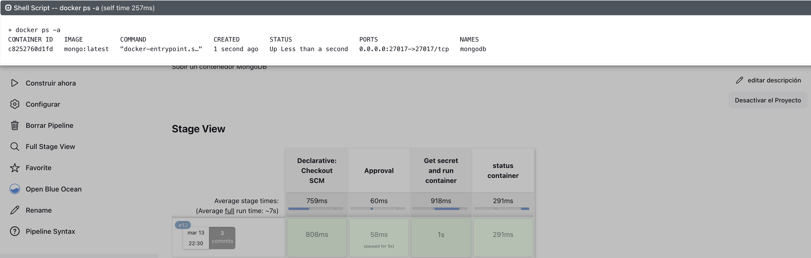

# MongoDB_Jenkins-Vault
Levantar un contenedor de Mongo utilizando Jenkins y Vault

## Para ver un tutorial de integrar Jenkins con Vault 

https://medium.com/@giovannyorjuel2/integrando-jenkins-con-vault-2f1d42e31f95

En este turorial vamos a ver lo siguiente 

- **Levantamiento del Contenedor de MongoDB**: Utilizando las herramientas de gestión de contenedores, Jenkins levantará un contenedor de MongoDB utilizando la imagen previamente descargada. Durante este proceso, se utilizarán las credenciales obtenidas de Vault para autenticarse en MongoDB.

- **Pruebas y Validación**: Una vez que el contenedor de MongoDB esté en funcionamiento, se ejecutarán las pruebas necesarias para verificar su correcto despliegue y funcionamiento. Esto podría incluir pruebas de conexión, creación de bases de datos y colecciones, entre otras.

- **Monitoreo y Mantenimiento**: Finalmente, se establecerán mecanismos de monitoreo para supervisar el estado del contenedor de MongoDB en tiempo real. Además, se implementarán procedimientos de mantenimiento para gestionar actualizaciones y posibles problemas de forma proactiva.

Este proceso asegura un despliegue seguro y automatizado de un contenedor de MongoDB utilizando Jenkins y Vault. 

